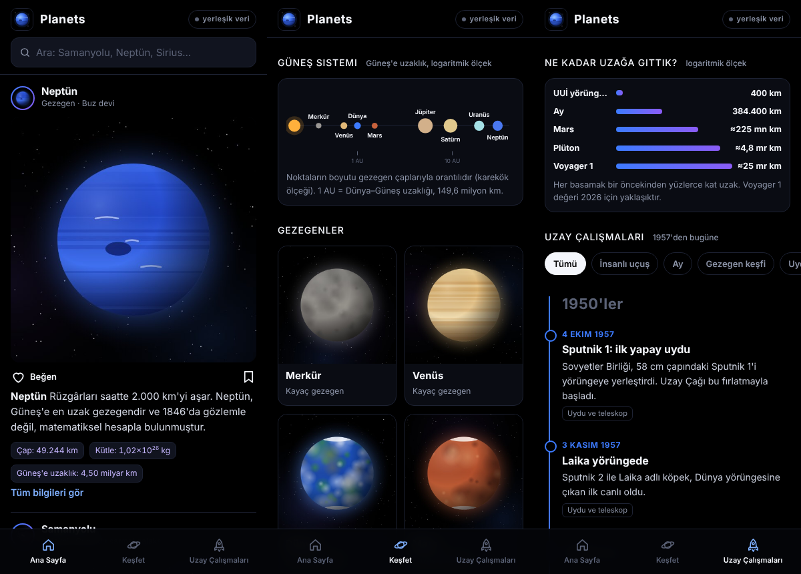

<p align="center"></p>

# Planets

Güneş Sistemi'ndeki gezegenleri, bazı önemli yıldızları ve galaksileri anlatan, siyah temalı bir uzay uygulaması. Tek bir HTML dosyasından oluşur; aynı dosya hem tarayıcıda hem de Android uygulamasının içinde çalışır.



## Özellikler

- **Ana Sayfa:** Gezegen, yıldız ve galaksilerin post şeklinde aktığı bir akış. Üstteki arama çubuğu tüm içerikte arar (örneğin "Samanyolu").
- **Keşfet:** 8 gezegen, 7 yıldız ve 7 galaksi. Her birinde üstte görsel, altında açıklama, bilgi tablosu (çap, kütle, tahmini yaş, yıldız sayısı vb.) ve boyut karşılaştırma grafiği bulunur.
- **Uzay Çalışmaları:** 1957'deki Sputnik 1'den 2026'daki Artemis II'ye kadar önemli olayların kronolojisi, kategori filtreleri ve grafiklerle.

## Veri kaynakları

- Görseller, internet varken [Wikipedia REST API](https://en.wikipedia.org/api/rest_v1/) üzerinden çekilir.
- "Günün Uzay Görseli", NASA'nın ücretsiz [APOD API](https://api.nasa.gov/)'sinden gelir (`DEMO_KEY` ile; günlük istek sınırı düşüktür).
- İnternet yoksa uygulama kendi çizdiği görselleri gösterir.
- Açıklamalar ve tablo değerleri uygulamanın içinde gömülüdür. Değerler yaklaşık değerlerdir; yıldız ve galaksi ölçümleri tahminidir.

## Çalıştırma

**Tarayıcıda:** `index.html` dosyasını açman yeterli. GitHub Pages ile yayınlamak için depo ayarlarında Pages'i `main` dalının kök klasörüne yönlendir.

**Android:** Hazır APK'yı [Releases](../../releases) sayfasından indirebilirsin (Android 6.0 ve üzeri).

## APK'yı kendin derlemek

Android tarafı, `index.html` dosyasını tam ekran bir WebView içinde açan küçük bir kabuktur (`android/` klasörü). Gradle gerekmez:

```bash
APKTOOL=apktool.jar APKSIGNER=apksigner.jar KEYSTORE=planets.jks KS_PASS=sifren ./build-apk.sh
```

İmza anahtarı (`.jks`) depoya eklenmez; `.gitignore` bunu engeller.

## Klasör yapısı

```
index.html        Uygulamanın tamamı (arayüz, veri, çizimler)
android/          Android kabuğu: manifest, simge, MainActivity
build-apk.sh      APK derleme betiği
docs/             Simge ve ekran görüntüleri
```
